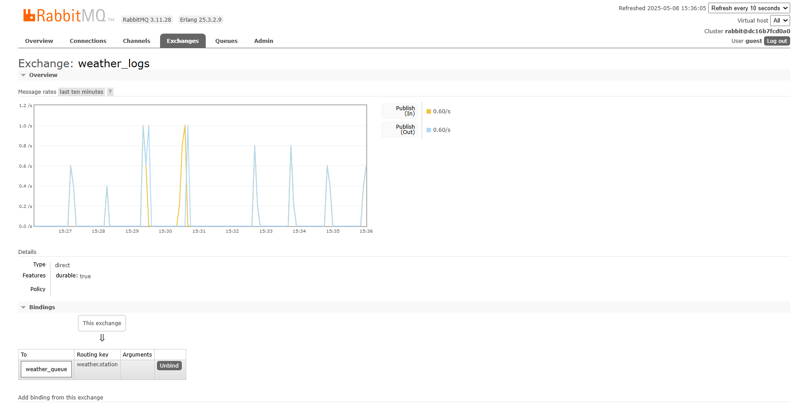
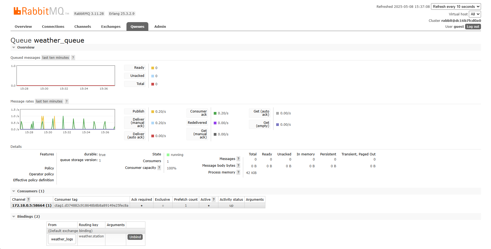

# Weather Logs System

**Prototipo MVP de gestión de logs de estaciones meteorológicas**

## 📋 Contenido del repositorio

```
/producer          # Microservicio que genera y envía datos a RabbitMQ
/consumer          # Microservicio que recibe y persiste datos en PostgreSQL
/rabbitmq          # Configuración (definitions.json)
/postgres          # Script de inicialización de la base de datos (init_db.sql)
/docs              # Documentación del proyecto
  ├── contract.md  # Contrato de mensajes JSON y validación
  ├── tests.md     # Pruebas End-to-End documentadas
  └── images/      # Capturas y diagramas (p.ej. RabbitMQ, flujos)

docker-compose.yml # Orquestación de todos los servicios
README.md          # Documentación general y enlaces a secciones clave
```

---

## 🚀 Despliegue rápido

1. Clonar el repositorio:
   ```bash
   git clone git@github.com:TU_USUARIO/weather-logs-system.git
   cd weather-logs-system
   ```

2. Levantar todos los servicios con Docker Compose:
   ```bash
   docker-compose up --build -d
   ```

3. Verificar estado de contenedores:
   ```bash
   docker ps
   ```

4. Acceder al Dashboard de RabbitMQ:
   - URL: http://localhost:15672
   - Usuario: `guest` / Contraseña: `guest`

5. Ejecutar pruebas e2e documentadas:
   ```bash
   # Consulta pruebas manuales
   less docs/tests.md
   ```

---

## 🛠 Estructura de Microservicios

### Producer
- **Carpeta:** `/producer`
- **Función:** Genera datos aleatorios de estaciones y los envía al exchange de RabbitMQ.
- **Ejecutar localmente:**
  ```bash
  cd producer
  py -3 -m venv .venv
  .\.venv\Scripts\Activate.ps1
  pip install -r requirements.txt
  copy .env.example .env
  python send.py
  ```

### Consumer
- **Carpeta:** `/consumer`
- **Función:** Consume mensajes, valida rangos y persiste en PostgreSQL.
- **Ejecutar localmente:**
  ```bash
  cd consumer
  py -3 -m venv .venv
  .\.venv\Scripts\Activate.ps1
  pip install -r requirements.txt
  copy .env.example .env
  python consume.py
  ```

---

## 📖 Documentación adicional

- **Contrato de Mensajes**: Formato JSON, rangos de validación y reglas de error.  
  ➡️ [Ver `docs/contract.md`](docs/contract.md)

- **Pruebas End-to-End**: Pasos, comandos, resultados esperados y observados.  
  ➡️ [Ver `docs/tests.md`](docs/tests.md)

- **Diagrama de Arquitectura**: Flujo Producer → RabbitMQ → Consumer → PostgreSQL.  
  ➡️ `docs/images/architecture.drawio`

---

## 📂 Carpetas y Archivos Clave

| Elemento                  | Descripción                                                         |
|---------------------------|---------------------------------------------------------------------|
| `docker-compose.yml`      | Orquesta RabbitMQ, PostgreSQL, producer y consumer.                 |
| `producer/Dockerfile`     | Define la imagen Docker para el producer.                           |
| `consumer/Dockerfile`     | Define la imagen Docker para el consumer.                           |
| `postgres/init_db.sql`    | Script SQL para crear la tabla `weather_logs` y sus índices.        |
| `rabbitmq/definitions.json`| Configuración (exchange, queues) exportada desde RabbitMQ admin UI. |

---

## 📑 Ejemplos de Mensajes JSON y Capturas de Dashboard

### Ejemplo de mensaje JSON enviado por el Producer
```json
{
  "station_id": "ST-1234",
  "timestamp": "2025-05-08T12:34:56Z",
  "temperature": 23.45,
  "humidity": 56.78,
  "pressure": 1013.25
}
```

### Capturas del Dashboard de RabbitMQ



> En las capturas se observa el exchange `weather_logs` y la queue `weather_queue` con mensajes publicados y consumidos.
---

## 📌 Buenas prácticas

- Usa ramas `develop` para desarrollo y `main` para versiones estables.
- Documenta cada cambio significativo con PRs y mensajes de commit claros.
- Mantén los entornos virtuales aislados en cada microservicio.

---

*Última actualización: 2025-05-08*
