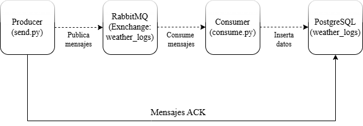

# Diagrama de Arquitectura

Este diagrama muestra el flujo general del sistema y cómo interactúan los componentes:

## Descripción de componentes
1. **Producer** (`producer/send.py`):
   - Genera y envía mensajes JSON al `exchange` **weather_logs** en RabbitMQ.
   - Declara el exchange como durable para persistencia de mensajes.

2. **RabbitMQ**:
   - **Exchange**: `weather_logs` (tipo `direct`).
   - **Queue**: `weather_queue`, enlazada al exchange con `routing_key` `weather.station`.

3. **Consumer** (`consumer/consume.py`):
   - Declara la cola durable y enlaza al exchange.
   - Consume mensajes con `prefetch_count=1` y ack manual.
   - Valida rangos de datos y registra errores.

4. **PostgreSQL**:
   - Tabla `weather_logs` donde se persisten los registros válidos.
   - Script de inicialización: `postgres/init_db.sql`.

