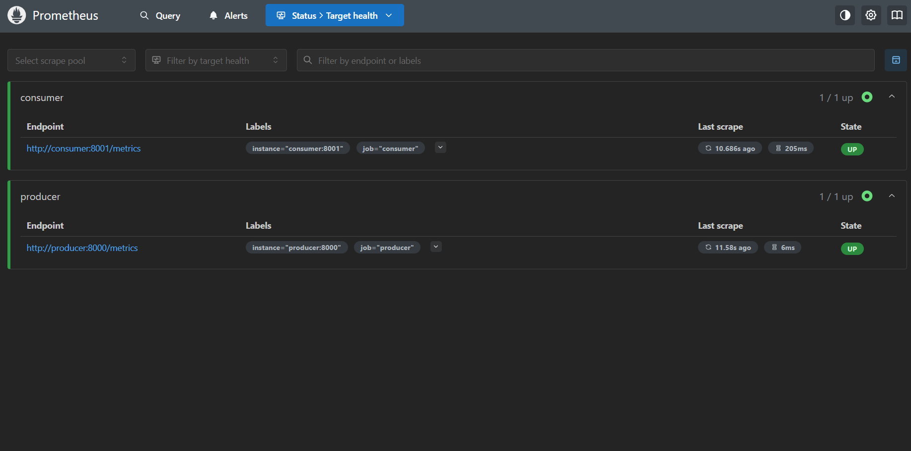
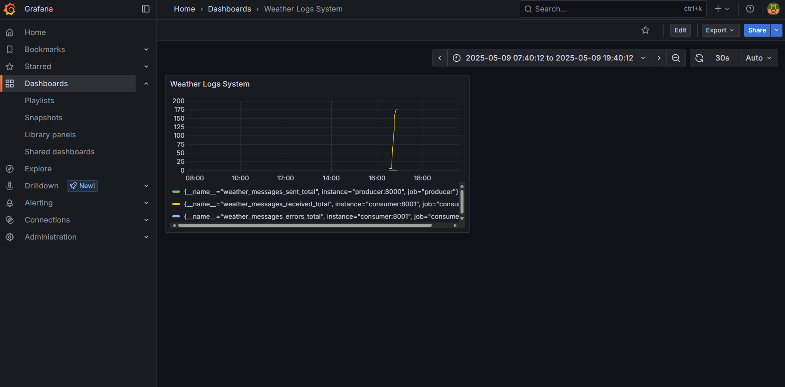

# Monitoreo con Prometheus y Grafana

Este documento describe la integración de métricas en los microservicios y la configuración de **Prometheus** y **Grafana** para monitorizar la salud y el rendimiento del sistema.

---

## Índice

1. [Instrumentación de métricas](#1-instrumentación-de-métricas)
2. [Configuración de Prometheus](#2-configuración-de-prometheus)
3. [Configuración de Grafana](#3-configuración-de-grafana)
4. [Verificación y dashboards](#4-verificación-y-dashboards)

---

## 1. Instrumentación de métricas

### 1.1 Dependencias

En los servicios **Producer** y **Consumer** se añadió la biblioteca:

```text
prometheus_client
```

Y se actualizó `requirements.txt` en cada carpeta.

### 1.2 Producer (`producer/send.py`)

* Se importaron e instanciaron:

  ```python
  from prometheus_client import Counter, Summary, start_http_server

  MSG_SENT = Counter('weather_messages_sent_total', 'Total de mensajes enviados')
  SEND_LATENCY = Summary('weather_send_latency_seconds', 'Latencia de envío de mensajes')
  ```
* Se arrancó el servidor de métricas en el puerto 8000:

  ```python
  start_http_server(8000)
  ```
* Dentro del bucle de envío continuo:

  ```python
  with SEND_LATENCY.time():
      enviar_mensaje(channel)
  MSG_SENT.inc()
  ```

### 1.3 Consumer (`consumer/consume.py`)

* Se importaron e instanciaron:

  ```python
  from prometheus_client import Counter, start_http_server

  MSG_RECEIVED = Counter('weather_messages_received_total', 'Total de mensajes recibidos')
  MSG_ERRORS   = Counter('weather_messages_errors_total',   'Total de mensajes con error')
  ```
* Se arrancó el servidor de métricas en el puerto 8001:

  ```python
  start_http_server(8001)
  ```
* En el callback de cada mensaje:

  ```python
  MSG_RECEIVED.inc()  # al recibir un JSON válido
  MSG_ERRORS.inc()    # en caso de error o datos fuera de rango
  ```

---

## 2. Configuración de Prometheus

1. **Archivo de configuración**: `prometheus/prometheus.yml`

   ```yaml
   global:
     scrape_interval: 15s

   scrape_configs:
     - job_name: 'producer'
       static_configs:
         - targets: ['producer:8000']
     - job_name: 'consumer'
       static_configs:
         - targets: ['consumer:8001']
   ```

2. **Servicio en Docker Compose**:

   ```yaml
   services:
     prometheus:
       image: prom/prometheus:latest
       container_name: prometheus
       volumes:
         - ./prometheus/prometheus.yml:/etc/prometheus/prometheus.yml:ro
       ports:
         - "9090:9090"
       depends_on:
         - producer
         - consumer
   ```

---

## 3. Configuración de Grafana

1. **Servicio en Docker Compose**:

   ```yaml
   services:
     grafana:
       image: grafana/grafana:latest
       container_name: grafana
       ports:
         - "3000:3000"
       depends_on:
         - prometheus
   ```

2. **Primer arranque**:

   * Accede a `http://localhost:3000` (user: `admin`, pass: `admin`).
   * Añade **Prometheus** como Data Source con URL `http://prometheus:9090`.

---

## 4. Verificación y dashboards

### 4.1 Estado de scrapes en Prometheus

* Accede a `http://localhost:9090/targets` para verificar que ambos endpoints:

  * `producer:8000`
  * `consumer:8001`
    aparezcan en estado **UP**.

**Ejemplo de Visualización:**



### 4.2 Dashboard en Grafana

* Crea un dashboard nuevo con los siguientes paneles:

  1. **Mensajes enviados**

     ```promql
     weather_messages_sent_total
     ```
  2. **Mensajes recibidos**

     ```promql
     weather_messages_received_total
     ```
  3. **Errores de consumer**

     ```promql
     weather_messages_errors_total
     ```
  4. **Latencia 95% envío**

     ```promql
     histogram_quantile(0.95, sum(rate(weather_send_latency_seconds_bucket[1m])) by (le))
     ```

**Ejemplo de Visualización:**



---

*Última actualización: 2025-05-09*
